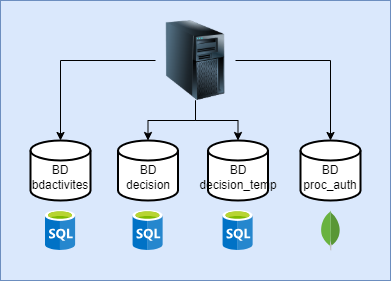

# Projet Datamining - Gestion des Bases de Données

Ce projet s’inscrit dans le cadre du module **Datamining**. Il vise à exploiter des données issues de diverses sources pour en extraire des informations pertinentes, à l’aide de techniques de fouille de données, de bases de données relationnelles et d’analyses croisées.

## Architecture
L’ensemble des bases de données est hébergé sur un seul serveur sur une machine virtuelle.

### Bases de Données et Schémas
1. **Database activites**
   - Contenu : Gère les services, les clients, les produits,...
   - Schéma : 

### Scripts SQL de Création des Bases de Données
Les scripts de création des bases de données sont disponibles dans le répertoire principal :
- `commande sql db activites`

